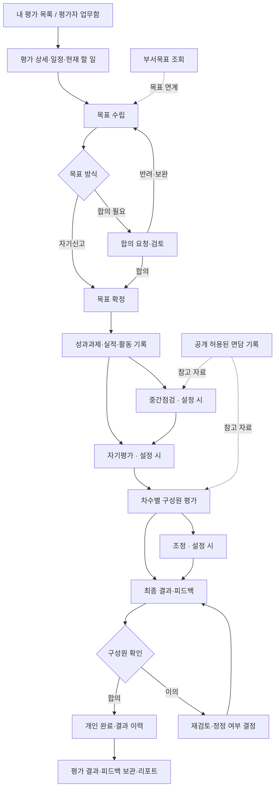

# 구성원 평가 전체 사이클 분석 결과

2026-09-07 · easy-performance-management

사용자가 제공한 17개 링크 중 중복된 평가 결과 조정 1개를 제외한 **16개 가이드 본문 분석을 완료**했다. 평가자의 피드백 작성 연결을 확인하기 위해 관련 가이드 1개를 추가로 읽었다. 현재 프런트·백엔드 코드와의 차이도 정리했다. **이번 단계에서는 제품 코드를 변경하지 않았다. 다음 입력은 관리자 가이드다.**

## 결론

현재 구현은 단일 KPI 평가의 목표→중간점검→자기/1차 평가→보정→결과 흐름을 검증한 기반이다. 이를 RootHR의 상세 가이드에 대응하는 전체 기능이라고 볼 수 없다. 한 화면에 여러 단계의 폼을 누적한 정보 구조와, 설정에 따라 바뀌는 평가 업무를 표현하지 못하는 데이터 모델을 함께 개선해야 한다.

후속 구현은 독립된 업무 목록과 단계별 상세 화면을 만들고, 과제·활동·면담·평가 문항·차수별 응답을 실제 저장·조회·권한·상태 전환까지 연결하는 작업이다. 이전 테스트 통과는 기존 범위를 증명하며 이번 확장 요구의 충족 근거로 대신 사용하지 않는다.

## 가이드 대조표

아래 요구는 원문을 요약한 것이며 설계 세부나 관리자 정책이 확정됐다는 의미는 아니다. 각 문서의 입력·행동·권한·제약과 출처는 연결된 상세 분석에 있다.

| ID | 가이드 | 후속 화면·기능의 핵심 | 현재 구현과의 차이 |
|---|---|---|---|
| M01 | 나의 평가 수행 | 개인별 평가 카드, 유형·설정에 맞는 단계와 상태 | 하나의 고정 워크스페이스·단계열 |
| M02 | 목표 수립 | 목표 편집, 달성수준, 부서/표준 항목 연결, 자기신고·합의형 | 기본 제목/수치/가중치 중심, 경로·기준·연계 보강 |
| M03 | 자기평가 | 항목별 등급/점수·의견, 종합 의견, 저장/완료 | 자기평가가 종합 의견 중심 |
| M04 | 피드백 확인 | 진행 중 평가의 결과 합의·이의·재검토 | 원결과 유지 처리만 연결; 결과 정정 경로 미완성 |
| M05 | 구성원 평가 수행 | 합의자·평가자·조정자·최종 평가자의 업무함 | 1차 매니저와 운영자 중심 |
| M06 | 목표 합의 | 직원별 요청함, 의견 초안, 합의/반려, 수정·합의 이력 | 승인/반려 기반은 있으나 협의 기록 부족 |
| M07 | 중간점검 | 과제 진행 그래프·활동 근거와 점검 의견 | 실적/의견은 있으나 과제 상세 연결 부족 |
| M08 | 평가 작성 | 그룹·차수별 현황, 근거 참조, 항목별 응답 | 다차수·다평가자 응답 모델 부재 |
| M09 | 결과 조정 | 지정 조정자, 점수/등급, 기준·현재 배분, 저장/완료 | 보정 기반은 있으나 업무 배정·설정형 운영 보강 |
| M10 | 부서 목표 조회 | 조직 선택과 부서 목표 읽기 | KPI 트리 기반은 있으나 구성원용 경로·연계 부족 |
| M11 | 성과과제 관리 | 보드, 체크리스트/실적, 관계자, 활동/파일/피드백/라벨 | 별도 과제·활동·관계자 모델 부재 |
| M12 | 면담리뷰 작성 | 직원/참조자, 기록과 역할별 공개 | 독립 면담 기록과 공개 모델 부재 |
| M13 | 면담리뷰 조회 | 작성·본인·직원별·참조 탭과 상세 | 단순 멘토 피드백은 이 기능을 대체하지 못함 |
| M14 | 평가 리포트 | 최신 결과, 최근 5년 추이·구간 분포·이력 | 현재 사이클 결과 스냅샷 중심 |
| M15 | 평가 피드백 조회 | 과거 평가 선택, 항목별 의견, 해당 시 다면 비교 | 진행 중 합의/이의 화면과 별도 조회 필요 |
| M16 | 평가 결과 조회 | 본인 정보·최신 점수/등급·전체 이력 | 독립 결과 보관/조회 화면 미흡 |

출처와 상세: [핵심 10문서·피드백 작성](01_primary_guides.md), [부서목표·과제·면담·리포트 6문서](02_supporting_guides.md). 실제 코드 근거: [백엔드 대조](03_backend_gap.md), [프런트 대조](04_frontend_gap.md).

## 화면과 프로세스의 연결안

다음은 가이드에서 도출한 **설계안**이다. 선택 단계·차수·공개 시점은 관리자 가이드 분석 후 확정한다.

성과과제는 평가 기간 중 계속 갱신하는 업무이며 중간점검 이후에도 활동이 이어질 수 있다. 면담/과제 근거가 자동으로 평가 점수가 되는 것은 아니다. 개인 완료, 차수 완료, 결과 공개, 전사 사이클 마감은 서로 다른 상태로 설계한다.

## 필요한 화면 구조

한 장의 폼 대신 다음 업무 공간을 둔다. 화면 이름과 URL은 확정 전 제안이다.

- **내 평가**: 진행·종료 목록 → 평가 상세 → 목표 편집/의견/이력 → 자기평가 → 결과 합의·이의.
- **구성원 평가**: 단계·차수·그룹별 업무함 → 직원 선택 → 목표 합의 / 중간점검 / 평가 작성 / 조정 / 최종 피드백. 같은 직원의 참고자료를 상세 옆에서 읽는다.
- **부서 목표**: 조직 선택과 목표 조회, 개인 목표로 연결되는 맥락.
- **성과과제**: 보드·목록과 과제 상세의 속성/활동/피드백, 체크리스트·실적·관계자·라벨.
- **면담리뷰**: 네 가지 조회 탭과 작성/상세, 작성자·대상자·참조자별 공개 판정.
- **결과 기록**: 평가 결과 목록, 과거 항목별 피드백, 장기 추이 리포트.

완료한 단계는 읽기 전용으로 다시 열 수 있게 하고, 미개시·미배정·기간 종료·기준 미충족을 구분해 사유를 보여준다. 이전 UUID 입력 기반 숨은 페이지를 그대로 다시 노출하지 않고 현재 계정·배정 권한에 맞게 연결한다.

## 관리자 가이드에서 결합할 항목

1. 평가 유형·양식·항목 라이브러리·척도·가중치·필수 의견 설정과 버전 보존.
2. 합의형/자기신고형, 자기평가·중간점검·조정·피드백 선택, 단계별 기간과 차수 선후행.
3. 대상 그룹, 합의자·차수별 평가자·조정자·최종 평가자 지정과 예외/변경 처리.
4. 상대평가 배분 인원·반올림·예외와 완료 검증, 점수·등급 관계.
5. 결과 계산·확정·공개, 점수/등급/의견별 공개 범위, 이의 후 정정·재발행·마감.
6. 부서목표 관리 권한과 공개 조직 범위, 과제 관계자별 편집/상태변경 권한.
7. 면담 기록의 관리자 예외 열람·공개 변경·수정/삭제, 증빙 파일 제한 및 보관 방식.
8. 다면평가를 포함한 결과의 easy-mra 연결·공개·익명성 및 장기 리포트 비교 기준.

이 항목들은 사용자가 지금 답해야 하는 질문 목록이 아니라, 다음 관리자 자료에서 분석할 확인 목록이다. 문서에 없으면 합리적인 기본 설계를 제안하고, 제품 운영에 중요한 미확정 결정만 따로 표시한다.

## 공통화와 구현 경계

- easy-ware/easy-hcm 계열의 SuiteShell·토큰·표·폼·상태표시를 유지한다. RootHR의 업무를 참고하되 시각 스타일은 자매품 기준을 따른다.
- 한국어·영어·일본어·중국어 간체·베트남어를 새 화면에도 함께 적용한다. 시스템 UI 번역과 고객이 작성하는 목표/평가 문항 번역 정책은 구분한다.
- 공유 후보는 업무 목록+상세 프레임, 단계 내비게이션, 의견/이력 패널, 근거자료 패널, 분포 비교 등이다. 실제 재사용 계약이 성립하는 것만 Easy Design System 자산과 Storybook으로 등록한다.
- 인증·테넌트·감사·오류·식별자 등 기존 core를 재사용한다. 평가 정의/응답/배정/공개 규칙은 성과관리 제품이 소유한다.
- Neon은 고객 프로젝트 아래 제품 DB 구조를 유지한다. 이번 분석으로 실제 고객 DB나 공통 관리 DB를 변경하지 않았다.

## 후속 구현 순서와 완료 기준

관리자 분석 후 요구표를 합쳐, 먼저 평가 정의/단계/권한·상태 계약을 정하고 목표·과제·점검·평가·조정·결과/면담의 순서로 FE/BE를 연결한다. 화면만 늘리거나 로컬 임시 데이터를 저장 완료로 표시하지 않는다.

완료 검증에는 자기신고/합의 반려재요청, 목표 가중치·수준 기준, 과제 체크리스트/실적, 면담 공개 조합, 선택 단계 생략, 다차수 저장/완료/잠금, 배분 기준 조정, 최종 피드백·이의·정정, 과거 결과 공개 범위를 포함한다. 각 경로를 실제 역할별 API와 브라우저에서 검증하고 5개 언어·모바일·공통 자산을 함께 확인한다.

## 분석 한계

일부 외부 스크린샷은 시간 초과로 작은 UI 요소를 판독하지 못했다. 본문에 나온 기능·화면 구성은 확인했으며 이미지 전체를 픽셀 단위로 분석했다고 주장하지 않는다. 관리자 설정, 외부 제품 내부 DB/API, 문서에 없는 자동 알림·일정/회의 운영·파일 정책은 아직 확정하지 않았다. 프런트·백엔드 세부 문서의 일반 확장 아이디어는 원문 필수 요구와 구분해서 취급한다.
